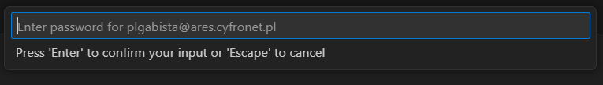

## Running a Jupyter Notebook with the SoS kernel on Ares

This guide explains how to run a Jupyter notebook that uses the SoS kernel (allowing multi-language support, e.g. Python and R) on the Ares HPC system.

---

### 1. Log in to Ares

Connect to Ares via SSH:

```
ssh USER@ares.cyfronet.pl
```

Replace `USER` with your actual login.

---

### 2. Create a working directory

On Ares, create a directory for your project:

```
mkdir -p ~/docker_hpc
```

---

### 3. Upload required files

On your local machine, copy the dataset and notebook to Ares using:

```
scp ./nobel.csv USER@ares.cyfronet.pl:~/docker_hpc/nobel.csv
scp ./notebook.ipynb USER@ares.cyfronet.pl:~/docker_hpc/notebook.ipynb
```

---

### 4. Connect to Ares via Visual Studio Code

1. Open VS Code.
2. Use the green button in the bottom-left corner → **Remote-SSH: Connect to Host...**
   
3. Select `USER@ares.cyfronet.pl` and enter your password.
   

---

### 5. Allocate compute resources (enter a worker node)

In the VS Code terminal on Ares, run:

```
srun -p plgrid-now --time 2:00:00 --pty /bin/bash -l
```

This allocates a compute node and opens a shell there.

---

### 6. Verify that Apptainer is available

Check Apptainer version with:

```
apptainer version
```

Apptainer is available by default on worker nodes.

---

### 7. Pull and run the Jupyter container

Navigate to the working directory:

```
cd ~/docker_hpc
```

Then pull and run the notebook container:

```
apptainer pull docker://vatlab/sos-notebook
apptainer run sos-notebook_latest.sif
```

> **Note:** pulling the container may take several minutes.

Once it's ready, it will display a Jupyter Notebook URL — **copy the full URL including the token**.

### 8. Open the notebook and connect to the kernel

1. Open `notebook.ipynb` in VS Code.
2. Click the kernel name in the top right corner → select **Existing Jupyter Server...**
   
3. Paste the full Jupyter URL with the token.
   
4. Create a new name for this server  
5. Select the **SoS kernel** from the available list.
   

---

Now you're ready to run the notebook with SoS support for Python, R and other languages
